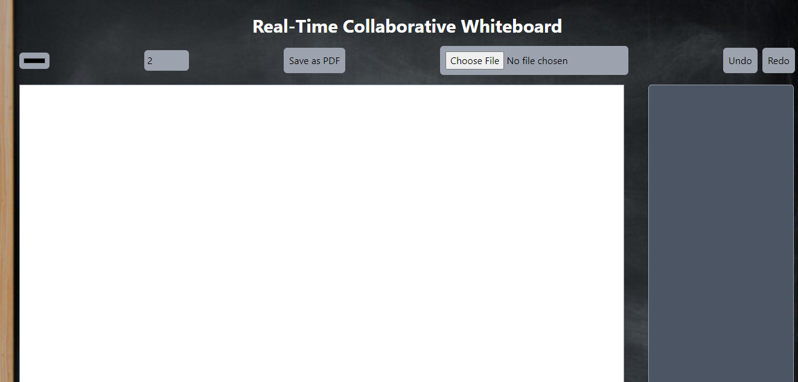
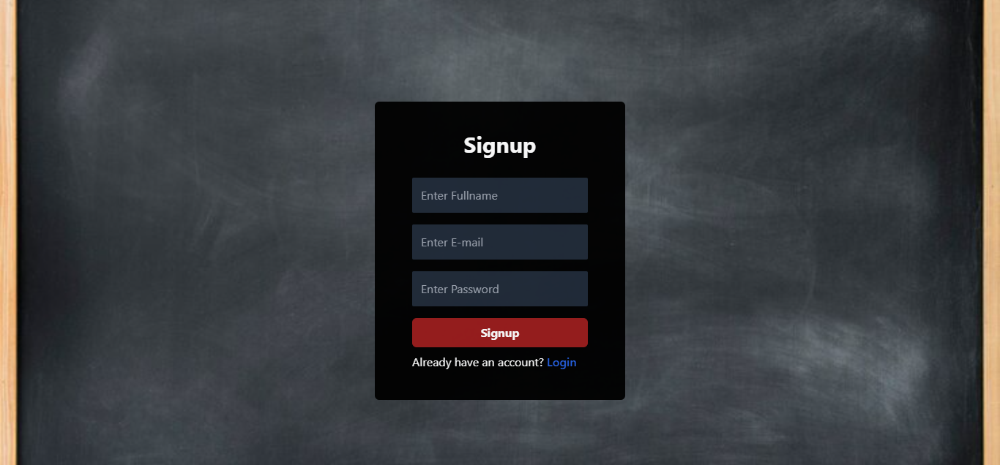
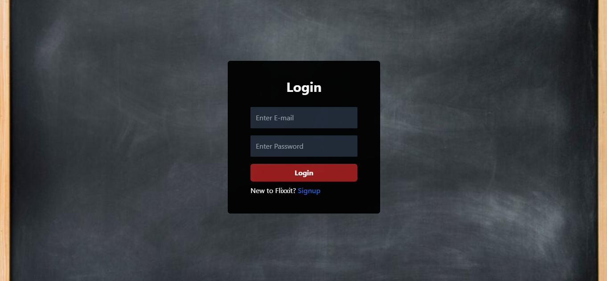

# Real-Time Collaborative Whiteboard
Real-Time Collaborative Whiteboard is an application build with the power of MERN Stack. Users can collaborate in real time.


Project Info :
client :
  | Tech      | Selection / Commands         |
  | --------- | ---------------------------- |
  | Client    |  React                       |
  | UI Setup  | `npm create vite@latest`     |
  | Framework | React                        |
  | Varient   | TypeScript                   |

Dependencies used :

 | Dependency        | Version | Command                   |
 | ----------------- | ------- | ------------------------- |
 |axios	             | ^1.6.8  |	`npm i axios `           |
 |jspdf	             | ^2.5.1  |  `npm i jspdf`            |
 |socket.io-client   | ^4.7.5  | `npm i socket.io-client`  |
 |react-hot-toast    | ^2.4.1  | `npm i react-hot-toast `  |
 |react-router-dom	 | ^6.22.3 | `npm i react-router-dom ` |

  ### server :

  | Tech       | Selection / Commands     |
  | ---------- | ------------------------ |
  | server     | Node + Express + MongoDB |
  | Setup      | `npm init -y`            |  

  **Dependencies used :**
  |Dependency| Version| Command|
  |----------|--------|--------|
  |cors | ^2.8.5 | `npm i cors`|
  |dotenv |^16.4.5 | `npm i dotenv`|
  |express | ^4.19.2 | `npm i express`|
  |mongoose | ^8.3.0 | `npm i mongoose`| 
  |socket.io | ^4.7.5 | `npm i socket.io` | 
  |jsonwebtoken| ^9.0.2| `npm i jsonwebtoken`|
  |bcrypt| ^5.1.1 | `npm i bcrypt`| 
  |body-parser | ^1.20.2 | `npm i body-parser` |
  |cookie-parser | ^1.4.6 | `npm i cookie-parser` |

  ## Project Setup

 - Clone entire project repo.
 - Open the cloned project with code editor.
 
 - **Setting up client:**
 - Go to app directory : `cd whiteboard`.
 - Install all the dependencies for client
    ```
    npm install
    ```
  - npm run dev
   

- **Setting up server:**   
- Go to app directory : `cd backend`.
  - Install all the dependencies for server
  - Now create .env file for enviroment variable.
    ```
    npm install
    ```
  - Run server
    ```
    npm run dev

# Project Snapshots :
  
  ## Signup :
  

  ## Login :
  

  ## Whiteboard main window :
  


**All Rights Reserved - Kumar Saurabh**